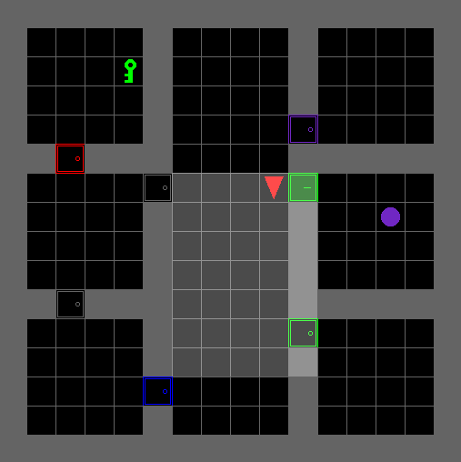
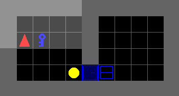
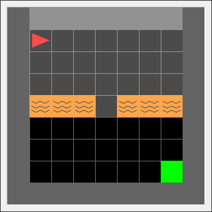

# Minimalistic Gridworld Environment (MiniGrid)

[](https://travis-ci.org/maximecb/gym-minigrid)

There are other gridworld Gym environments out there, but this one is
designed to be particularly simple, lightweight and fast. The code has very few
dependencies, making it less likely to break or fail to install. It loads no
external sprites/textures, and it can run at up to 5000 FPS on a Core i7
laptop, which means you can run your experiments faster. A known-working RL
implementation can be found [in this repository](https://github.com/lcswillems/torch-rl).

Requirements:
- Python 3.5+
- OpenAI Gym
- NumPy
- PyQT 5 for graphics

Please use this bibtex if you want to cite this repository in your publications:

```
@misc{gym_minigrid,
  author = {Chevalier-Boisvert, Maxime and Willems, Lucas and Pal, Suman},
  title = {Minimalistic Gridworld Environment for OpenAI Gym},
  year = {2018},
  publisher = {GitHub},
  journal = {GitHub repository},
  howpublished = {\url{https://github.com/maximecb/gym-minigrid}},
}
```

This environment has been built as part of work done at the [MILA](https://mila.quebec/en/). The Dynamic obstacles environment has been added as part of work done at [IAS in TU Darmstadt](https://www.ias.informatik.tu-darmstadt.de/) and the University of Genoa for mobile robot navigation with dynamic obstacles.

## Installation

Clone this repository and install the dependencies with `pip3`:

```
git clone https://github.com/maximecb/gym-minigrid.git
cd gym-minigrid
pip3 install -e .
```

## Basic Usage

There is a UI application which allows you to manually control the agent with the arrow keys:

```
./manual_control.py
```

The environment being run can be selected with the `--env-name` option, eg:

```
./manual_control.py --env-name MiniGrid-Empty-8x8-v0
```

## Reinforcement Learning

If you want to train an agent with reinforcement learning, I recommend using the code found in the [torch-rl](https://github.com/lcswillems/torch-rl) repository. This code has been tested and is known to work with this environment. The default hyper-parameters are also known to converge.

A sample training command is:

```
cd torch-rl
python3 -m scripts.train --env MiniGrid-Empty-8x8-v0 --algo ppo
```

## Design

MiniGrid is built to support tasks involving natural language and sparse rewards.
The observations are dictionaries, with an 'image' field, partially observable
view of the environment, a 'mission' field which is a textual string
describing the objective the agent should reach to get a reward, and a 'direction'
field which can be used as an optional compass. Using dictionaries makes it
easy for you to add additional information to observations
if you need to, without having to force everything into a single tensor.
If your RL code expects one single tensor for observations, please take a look at
`FlatObsWrapper` in
[gym_minigrid/wrappers.py](/gym_minigrid/wrappers.py).

The partially observable view of the environment uses a compact and efficient
encoding, with just 3 input values per visible grid cell, 7x7x3 values total.
If you want to obtain an array of RGB pixels instead, see the `get_obs_render` method in
[gym_minigrid/minigrid.py](gym_minigrid/minigrid.py).

Structure of the world:
- The world is an NxM grid of tiles
- Each tile in the grid world contains zero or one object
  - Cells that do not contain an object have the value `None`
- Each object has an associated discrete color (string)
- Each object has an associated type (string)
  - Provided object types are: wall, floor, lava, door, key, ball, box and goal
- The agent can pick up and carry exactly one object (eg: ball or key)
- To open a locked door, the agent has to be carrying a key matching the door's color

Actions in the basic environment:
- Turn left
- Turn right
- Move forward
- Pick up an object
- Drop the object being carried
- Toggle (open doors, interact with objects)
- Done (task completed, optional)

By default, sparse rewards are given for reaching a green goal tile. A
reward of 1 is given for success, and zero for failure. There is also an
environment-specific time step limit for completing the task.
You can define your own reward function by creating a class derived
from `MiniGridEnv`. Extending the environment with new object types or action
should be very easy. If you wish to do this, you should take a look at the
[gym_minigrid/minigrid.py](gym_minigrid/minigrid.py) source file.

## Included Environments

The environments listed below are implemented in the [gym_minigrid/envs](/gym_minigrid/envs) directory.
Each environment provides one or more configurations registered with OpenAI gym. Each environment
is also programmatically tunable in terms of size/complexity, which is useful for curriculum learning
or to fine-tune difficulty.

### Empty environment

Registered configurations:
- `MiniGrid-Empty-5x5-v0`
- `MiniGrid-Empty-Random-5x5-v0`
- `MiniGrid-Empty-6x6-v0`
- `MiniGrid-Empty-Random-6x6-v0`
- `MiniGrid-Empty-8x8-v0`
- `MiniGrid-Empty-16x16-v0`

<p align="center">

</p>

This environment is an empty room, and the goal of the agent is to reach the
green goal square, which provides a sparse reward. A small penalty is
subtracted for the number of steps to reach the goal. This environment is
useful, with small rooms, to validate that your RL algorithm works correctly,
and with large rooms to experiment with sparse rewards and exploration.
The random variants of the environment have the agent starting at a random
position for each episode, while the regular variants have the agent always
starting in the corner opposite to the goal.

### Four rooms environment

Registered configurations:
- `MiniGrid-FourRooms-v0`

<p align="center">

</p>

Classic four room reinforcement learning environment. The agent must navigate
in a maze composed of four rooms interconnected by 4 gaps in the walls. To
obtain a reward, the agent must reach the green goal square. Both the agent
and the goal square are randomly placed in any of the four rooms.

### Door & key environment

Registered configurations:
- `MiniGrid-DoorKey-5x5-v0`
- `MiniGrid-DoorKey-6x6-v0`
- `MiniGrid-DoorKey-8x8-v0`
- `MiniGrid-DoorKey-16x16-v0`

<p align="center">

</p>

This environment has a key that the agent must pick up in order to unlock
a goal and then get to the green goal square. This environment is difficult,
because of the sparse reward, to solve using classical RL algorithms. It is
useful to experiment with curiosity or curriculum learning.

### Multi-room environment

Registered configurations:
- `MiniGrid-MultiRoom-N2-S4-v0` (two small rooms)
- `MiniGrid-MultiRoom-N6-v0` (six rooms)

<p align="center">

</p>

This environment has a series of connected rooms with doors that must be
opened in order to get to the next room. The final room has the green goal
square the agent must get to. This environment is extremely difficult to
solve using RL alone. However, by gradually increasing the number of
rooms and building a curriculum, the environment can be solved.

### Fetch environment

Registered configurations:
- `MiniGrid-Fetch-5x5-N2-v0`
- `MiniGrid-Fetch-6x6-N2-v0`
- `MiniGrid-Fetch-8x8-N3-v0`

<p align="center">

</p>

This environment has multiple objects of assorted types and colors. The
agent receives a textual string as part of its observation telling it
which object to pick up. Picking up the wrong object produces a negative
reward.

### Go-to-door environment

Registered configurations:
- `MiniGrid-GoToDoor-5x5-v0`
- `MiniGrid-GoToDoor-6x6-v0`
- `MiniGrid-GoToDoor-8x8-v0`

<p align="center">

</p>

This environment is a room with four doors, one on each wall. The agent
receives a textual (mission) string as input, telling it which door to go to,
(eg: "go to the red door"). It receives a positive reward for performing the
`done` action next to the correct door, as indicated in the mission string.

### Put-near environment

Registered configurations:
- `MiniGrid-PutNear-6x6-N2-v0`
- `MiniGrid-PutNear-8x8-N3-v0`

The agent is instructed through a textual string to pick up an object and
place it next to another object. This environment is easy to solve with two
objects, but difficult to solve with more, as it involves both textual
understanding and spatial reasoning involving multiple objects.

### Red and blue doors environment

Registered configurations:
- `MiniGrid-RedBlueDoors-6x6-v0`
- `MiniGrid-RedBlueDoors-8x8-v0`

The purpose of this environment is to test memory.
The agent is randomly placed within a room with one red and one blue door
facing opposite directions. The agent has to open the red door and then open
the blue door, in that order.  The agent, when facing one door, cannot see
the door behind him. Hence, the agent needs to remember whether or not he has
previously opened the other door in order to reliably succeed at completing
the task.

### Memory environment

Registered configurations:
- `MiniGrid-MemoryS17Random-v0`
- `MiniGrid-MemoryS13Random-v0`
- `MiniGrid-MemoryS13-v0`
- `MiniGrid-MemoryS11-v0`
- `MiniGrid-MemoryS9-v0`
- `MiniGrid-MemoryS7-v0`

This environment is a memory test. The agent starts in a small room
where it sees an object. It then has to go through a narrow hallway
which ends in a split. At each end of the split there is an object,
one of which is the same as the object in the starting room. The
agent has to remember the initial object, and go to the matching
object at split.

### Locked room environment

Registed configurations:
- `MiniGrid-LockedRoom-v0`

The environment has six rooms, one of which is locked. The agent receives
a textual mission string as input, telling it which room to go to in order
to get the key that opens the locked room. It then has to go into the locked
room in order to reach the final goal. This environment is extremely difficult
to solve with vanilla reinforcement learning alone.

### Key corridor environment

Registed configurations:
- `MiniGrid-KeyCorridorS3R1-v0`
- `MiniGrid-KeyCorridorS3R2-v0`
- `MiniGrid-KeyCorridorS3R3-v0`
- `MiniGrid-KeyCorridorS4R3-v0`
- `MiniGrid-KeyCorridorS5R3-v0`
- `MiniGrid-KeyCorridorS6R3-v0`

<p align="center">
    
    
    
    
    
    
</p>

This environment is similar to the locked room environment, but there are
multiple registered environment configurations of increasing size,
making it easier to use curriculum learning to train an agent to solve it.
The agent has to pick up an object which is behind a locked door. The key is
hidden in another room, and the agent has to explore the environment to find
it. The mission string does not give the agent any clues as to where the
key is placed. This environment can be solved without relying on language.

### Unlock environment

Registed configurations:
- `MiniGrid-Unlock-v0`

<p align="center">
    
</p>

The agent has to open a locked door. This environment can be solved without
relying on language.

### Unlock pickup environment

Registed configurations:
- `MiniGrid-UnlockPickup-v0`

<p align="center">
    
</p>

The agent has to pick up a box which is placed in another room, behind a
locked door. This environment can be solved without relying on language.

### Blocked unlock pickup environment

Registed configurations:
- `MiniGrid-BlockedUnlockPickup-v0`

<p align="center">
    
</p>

The agent has to pick up a box which is placed in another room, behind a
locked door. The door is also blocked by a ball which the agent has to move
before it can unlock the door. Hence, the agent has to learn to move the ball,
pick up the key, open the door and pick up the object in the other room.
This environment can be solved without relying on language.

## Obstructed maze environment

Registered configurations:
- `MiniGrid-ObstructedMaze-1Dl-v0`
- `MiniGrid-ObstructedMaze-1Dlh-v0`
- `MiniGrid-ObstructedMaze-1Dlhb-v0`
- `MiniGrid-ObstructedMaze-2Dl-v0`
- `MiniGrid-ObstructedMaze-2Dlh-v0`
- `MiniGrid-ObstructedMaze-2Dlhb-v0`
- `MiniGrid-ObstructedMaze-1Q-v0`
- `MiniGrid-ObstructedMaze-2Q-v0`
- `MiniGrid-ObstructedMaze-Full-v0`

<p align="center">
  
  
  
  
  
  
  
  
  
</p>

The agent has to pick up a box which is placed in a corner of a 3x3 maze.
The doors are locked, the keys are hidden in boxes and doors are obstructed
by balls. This environment can be solved without relying on language.

The agent has to pick up a box which is placed in a corner of a 3x3 maze.
The doors are locked, the keys are hidden in boxes and doors are obstructed
by balls. This environment can be solved without relying on language.

## Lava crossing environment

Registered configurations:
- `MiniGrid-LavaCrossingS9N1-v0`
- `MiniGrid-LavaCrossingS9N2-v0`
- `MiniGrid-LavaCrossingS9N3-v0`
- `MiniGrid-LavaCrossingS11N5-v0`

<p align="center">
  
  
  
  
</p>

The agent has to reach the green goal square on the other corner of the room
while avoiding rivers of deadly lava which terminate the episode in failure.
Each lava stream runs across the room either horizontally or vertically, and
has a single crossing point which can be safely used;  Luckily, a path to the
goal is guaranteed to exist. This environment is useful for studying safety and
safe exploration.

## Distributional shift environment

Registered configurations:
- `MiniGrid-DistShift1-v0`
- `MiniGrid-DistShift2-v0`

This environment is based on one of the DeepMind [AI safety gridworlds](https://github.com/deepmind/ai-safety-gridworlds).
The agent starts in the top-left corner and must reach the goal which is in the top-right corner, but has to avoid stepping
into lava on its way. The aim of this environment is to test an agent's ability to generalize. There are two slightly
different variants of the environment, so that the agent can be trained on one variant and tested on the other.

<p align="center">
  
  
</p>

## Simple crossing environment

Registered configurations:
- `MiniGrid-SimpleCrossingS9N1-v0`
- `MiniGrid-SimpleCrossingS9N2-v0`
- `MiniGrid-SimpleCrossingS9N3-v0`
- `MiniGrid-SimpleCrossingS11N5-v0`

<p align="center">
  
  
  
  
</p>

Similar to the `LavaCrossing` environment, the agent has to reach the green
goal square on the other corner of the room, however lava is replaced by
walls. This MDP is therefore much easier and and maybe useful for quickly
testing your algorithms.

### Dynamic obstacles environment

Registered configurations:
- `MiniGrid-Dynamic-Obstacles-5x5-v0`
- `MiniGrid-Dynamic-Obstacles-Random-5x5-v0`
- `MiniGrid-Dynamic-Obstacles-6x6-v0`
- `MiniGrid-Dynamic-Obstacles-Random-6x6-v0`
- `MiniGrid-Dynamic-Obstacles-8x8-v0`
- `MiniGrid-Dynamic-Obstacles-16x16-v0`

<p align="center">

</p>

This environment is an empty room with moving obstacles. The goal of the agent is to reach the green goal square without colliding with any obstacle. A large penalty is subtracted if the agent collides with an obstacle and the episode finishes. This environment is useful to test Dynamic Obstacle Avoidance for mobile robots with Reinforcement Learning in Partial Observability.
